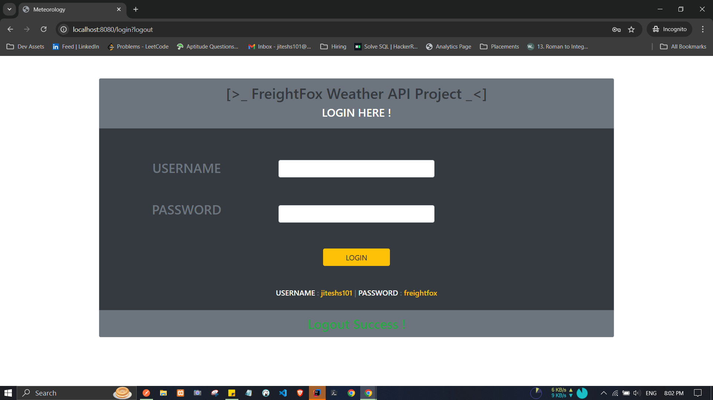
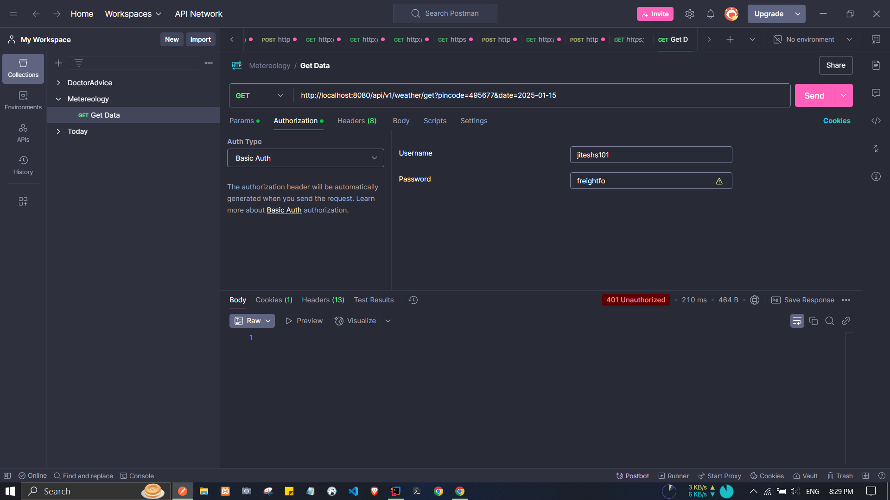
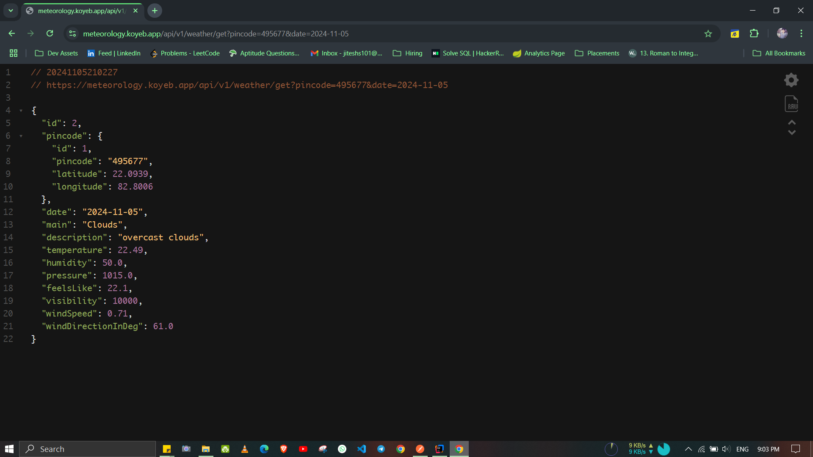
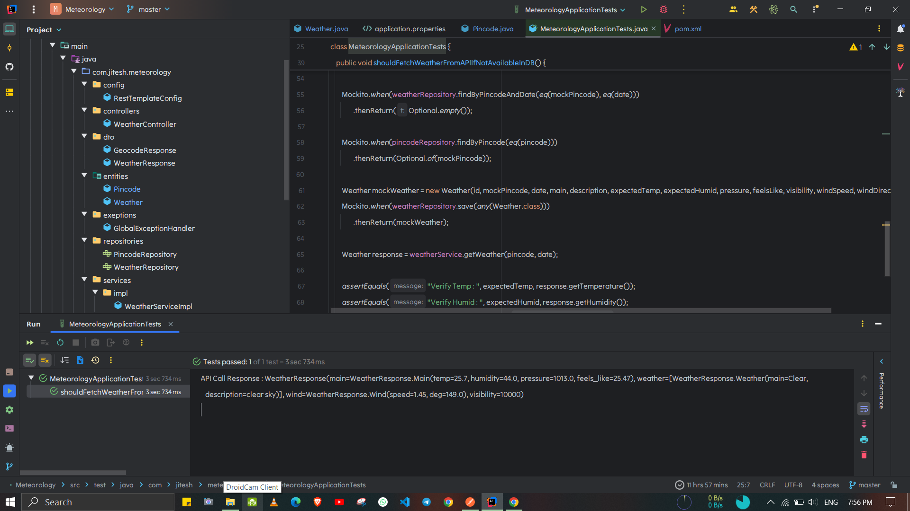
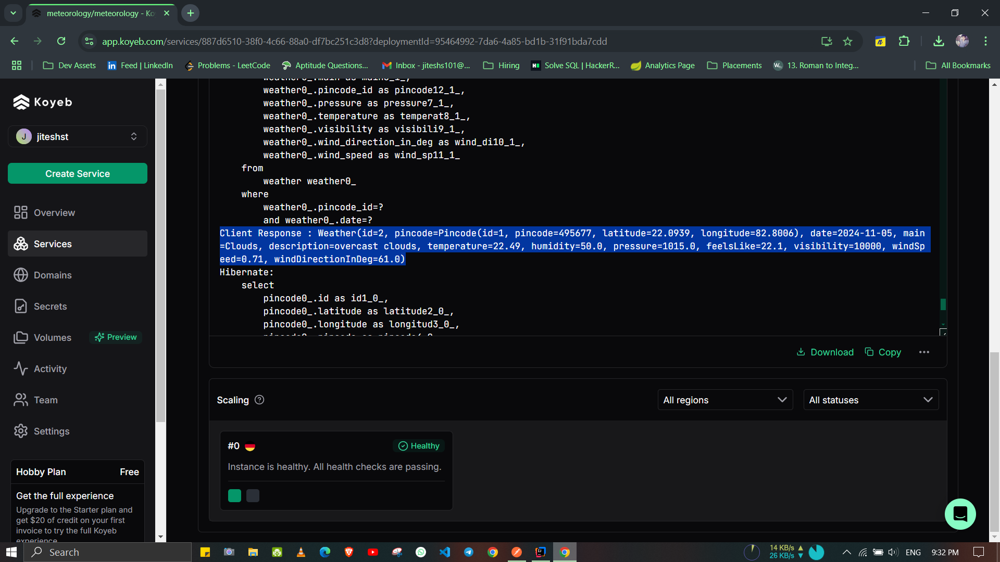

# WEATHER FOR PINCODE API

> :: [Hosting](https://meteorology.koyeb.app/api/v1/weather/get?pincode=495677&date=2025-01-15)

> EndPoints :

- GET - https://meteorology.koyeb.app/api/v1/weather/get?pincode=495677&date=2025-01-15

> Key Learnings :

- Securing API Using Basic Auth for REST Call and Form Based for Browser with Custom Login Page
- Handling Complex API data
- Have Familiar With RestTemplate but explored its horizon
- Complex Mocking

> SnapShots :

- Login Page 

- Postman Login 

- API  

- Postman  

- Unit Testing 

- Prod Logs 